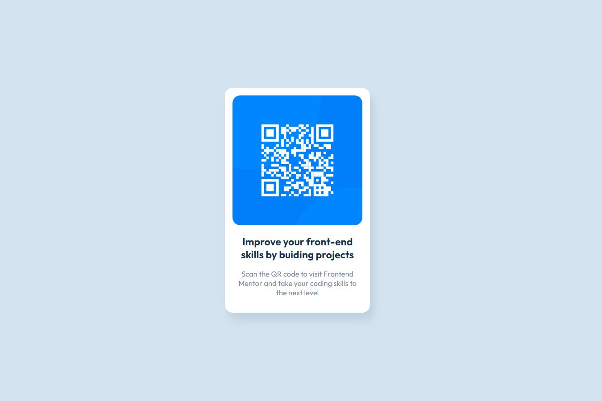

# Frontend Mentor - QR code component solution

This is a solution to the [QR code component challenge on Frontend Mentor](https://www.frontendmentor.io/challenges/qr-code-component-iux_sIO_H). Frontend Mentor challenges help you improve your coding skills by building realistic projects.

## Table of contents

- [Overview](#overview)
  - [Screenshot](#screenshot)
  - [Links](#links)
- [My process](#my-process)
  - [Built with](#built-with)
  - [What I learned](#what-i-learned)
  - [Continued development](#continued-development)
  - [Useful resources](#useful-resources)
- [Author](#author)
- [Acknowledgments](#acknowledgments)

**Note: Delete this note and update the table of contents based on what sections you keep.**

## Overview

### Screenshot



## Welcome! 👋

Hi, I am Lesly Chuo.
Thanks for checking out this front-end coding challenge.

[Frontend Mentor](https://www.frontendmentor.io) challenges help you improve your coding skills by building realistic projects.

**A Brief Overview**
**To do this challenge, you need a basic understanding of HTML and CSS.**

## The challenge

Your challenge is to build out this QR code component and get it looking as close to the design as possible.

You can use any tools you like to help you complete the challenge. So if you've got something you'd like to practice, feel free to give it a go.

Want some support on the challenge? [Join our Slack community](https://www.frontendmentor.io/slack) and ask questions in the **#help** channel.

## Where to find everything

Your task is to build out the project to the designs inside the `/design` folder. You will find both a mobile and a desktop version of the design.

The designs are in JPG static format. Using JPGs will mean that you'll need to use your best judgment for styles such as `font-size`, `padding` and `margin`.

If you would like the design files (we provide Sketch & Figma versions) to inspect the design in more detail, you can [subscribe as a PRO member](https://www.frontendmentor.io/pro).

You will find all the required assets in the `/images` folder. The assets are already optimized.

There is also a `style-guide.md` file containing the information you'll need, such as color palette and fonts.

## Building your project

Feel free to use any workflow that you feel comfortable with. Below is a suggested process, but do not feel like you need to follow these steps:

1. Initialize your project as a public repository on [GitHub](https://github.com/). Creating a repo will make it easier to share your code with the community if you need help. If you're not sure how to do this, [have a read-through of this Try Git resource](https://try.github.io/).
2. Configure your repository to publish your code to a web address. This will also be useful if you need some help during a challenge as you can share the URL for your project with your repo URL. There are a number of ways to do this, and we provide some recommendations below.
3. Look through the designs to start planning out how you'll tackle the project. This step is crucial to help you think ahead for CSS classes to create reusable styles.
4. Before adding any styles, structure your content with HTML. Writing your HTML first can help focus your attention on creating well-structured content.
5. Write out the base styles for your project, including general content styles, such as `font-family` and `font-size`.
6. Start adding styles to the top of the page and work down. Only move on to the next section once you're happy you've completed the area you're working on.

### Links

- Solution URL: [Add solution URL here](https://your-solution-url.com)
- Live Site URL: [Add live site URL here](https://your-live-site-url.com)

## My process

### Built with

- Semantic HTML5 markup
- CSS custom properties
- Flexbox
- CSS Grid
- Mobile-first workflow

### What I learned

I had an a brief walk through and understanding of CSS custom properties or variable.
Using this properties in combination with CSS HSL color attribute create much flexibily in color manipulation (lightness, alpha values and more).

Here is code sample

```css
:root {
  /* HSL Value */
  --hsl-clr-blue: 220, 15%, 55%;

  /* Color from HSL */
  --clr-blue: hsl(var(--hsl-clr-blue));
}

/* Using Color Properties */
.proud-of-this-css {
  background-color: var(--clr-blue);
}
.circle {
  box-shadow: 0.5rem 1rem 1rem hsla(var(--clr-blue), 0.2);
}
```

### Continued development

CSS custom properties provides great enhancement and generalization with a unique workflow accross your Code and Design.

### Useful resources

- [Kevin Powel](#) - Kevin Powel is a very interesting CSS Tutor. Follow this YouTube tutorial to understant CSS custom properties.

## Author

- Portfolio - [@Lesly, Dev_lee](https://www.letech-cg.com/portfolio)
- Frontend Mentor - [@ankain-lesly](https://www.frontendmentor.io/profile/ankain-lesly)
- Twitter - [@ankain-lesly](#)
- Linkedin - [@ankain-lesly](#)
